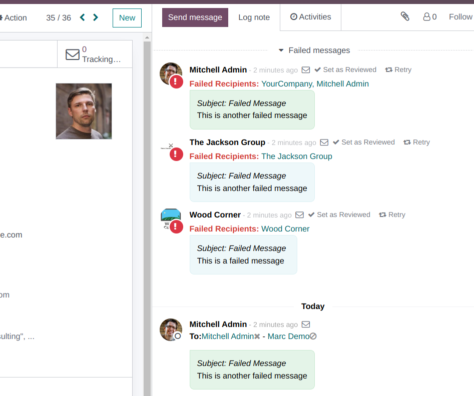

- Integrate with the core mail.notification model. A soft way would be to write a
  notification event along with the mail.tracking.event ones. Another way could be to
  merge both models and build the module features on top of it. This might imply a
  refactor though.
- Show failed messages in the chatter as below:
  
